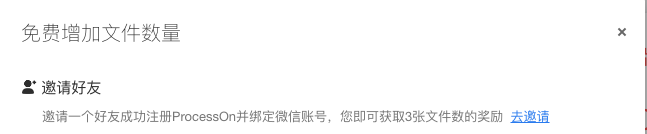

# ProcessOnRegister
> **免责声明**：
> 本项目仅做研究学习使用，不可用做商业用途或不法行为，因此造成的所有责任均由使用者负责，开发者不负任何责任。
ProcessOn微信注册

## 下载注册器

* [github](https://github.com/likly/ProcessOnRegister/releases)

## 开启你的表演

```shell
java -jar processon-register.jar {你的邀请链接}
```

> 需要安装`ChromeDriver`


## 原理解析

### 原理基础

根据**ProcessON**公布的邀新规则，每邀请一个新用户注册并绑定微信，即可获取3张文件数。原文如图所示：




### 流程分析

